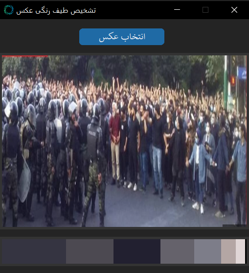

# image-color-palette-detector
This project is a desktop application built with Tkinter and CustomTkinter that allows users to select an image and extract its dominant color palette using the K-Means clustering algorithm. It provides a progress bar during processing and displays both the selected image and the resulting color spectrum. Useful for designers, artists, and developers interested in color analysis from photos.


<div align="center">



</div>

---

## :dart: Features

- 📁 Select and load any image from your system  
- 🧠 Automatically detect the dominant colors using machine learning (K-Means)  
- 🎨 Visualize a color bar representing the most frequent colors in the image  
- 🖼️ View the selected image alongside its color palette  
- 📊 Includes a progress bar while processing large images  
- 🧰 Simple and responsive UI built with `Tkinter` and `CustomTkinter`

---

## :clipboard: Prerequisites

To run this project, you need the following Python libraries:

- tkinter (usually included with Python)
- customtkinter
- Pillow
- opencv-python
- numpy
- scikit-learn

---

## :hammer_and_wrench: Installation

1.  Clone the repository:

    ```bash
    git clone https://github.com/vijeu/image-color-palette-detector.git
    cd <image-color-palette-detector>
    ```

2.  Install the required packages:

    ```bash
    pip install opencv-python scikit-learn Pillow customtkinter numpy
    ```
3. Download the icon file:

*    The project references an icon file (`icon.ico`) at `/icon/icon.ico`. Ensure this file is available or update the path in the code to a valid `.ico` file. Alternatively, remove the `window.iconbitmap` line if no icon is needed.

---

## :open_file_folder: Project Structure

```bash
ColorPaletteDetector/
│
├── main.py              
├── icon          
├── screenshots        
└── README.md
└── LICENSE
```

---

## :pushpin: Notes
- GUI labels and messages are in **Persian (Farsi)**.
- You can customize the number of colors by changing the `n_clusters` parameter in the code.
- To change the app icon, replace `icon.ico` with your own `.ico` file.

---

## :arrow_forward: Usage

1. Run the application:
```bash
python main.py
```
2. The GUI will open, centered on your screen.

3. Click the "انتخاب عکس" (Select Image) button to open a file dialog.

4. Choose an image file (e.g., `.jpg`, `.png`).

5. The application will:
- Display a progress bar and "در حال پردازش..." (Processing...) label.
- Process the image to extract the dominant color palette.
- Show the resized image (500x350 pixels) and the color palette below it.

---

## :page_facing_up: License

This project is licensed under the MIT License. See the LICENSE file for details.
